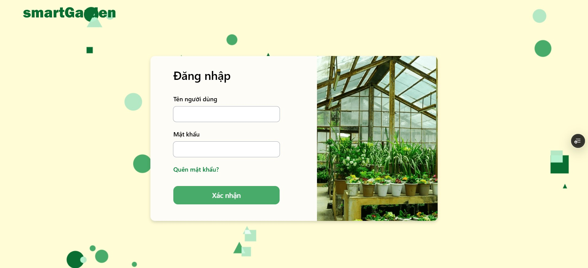

# Greenhouse Frontend


## Table of Contents

- [Project Overview](#project-overview)
- [Tech Stack](#tech-stack)
- [Project Structure](#project-structure)
- [Setup & Installation](#setup--installation)
- [Tooling & Configuration](#tooling--configuration)
- [Preview](#preview)
- [Additional Notes](#additional-notes)

## Project Overview

Greenhouse Frontend is a modern web application built with Vite, React, and TypeScript. It leverages Tailwind CSS for styling and follows best practices for maintainability and scalability.

## Tech Stack

- **Framework:** React (with Vite)
- **Language:** TypeScript
- **Package Manager:** Yarn
- **Styling:** Tailwind CSS
- **Linting & Formatting:** ESLint, Prettier
- **State Management:** React Context (or any state management tool used)

## Project Structure

```plaintext
.
├── App.css               # Global styles
├── App.tsx               # Root application component
├── assets/               # Static assets (e.g., images, icons)
├── components/           # Reusable UI components
├── config/               # Configuration files
├── context/              # React context providers
├── helpers/              # Utility functions
├── hooks/                # Custom React hooks
├── index.css             # Main CSS file
├── layouts/              # Layout components
├── libs/                 # External libraries
├── main.tsx              # Application entry point
├── pages/                # Application pages
├── services/             # API services and client
│   ├── apiClient.ts      # Axios API client
│   ├── authService.ts    # Authentication service
├── styles/               # Additional styles
├── types/                # TypeScript type definitions
├── vite-env.d.ts         # Vite environment types
```

## Setup & Installation

### Prerequisites

Ensure you have the following installed:

- **Node.js v20**
- **Yarn v1.22**

### Installation Steps

```sh
yarn install
```

### Running the Development Server

```sh
yarn dev
```

### Building for Production

```sh
yarn build
```

## Tooling & Configuration

### **ESLint Setup**

We use ESLint for linting JavaScript and TypeScript code.

#### Install ESLint & Configurations

```sh
yarn add -D eslint typescript-eslint eslint-plugin-react globals @eslint/js
```

#### ESLint Configuration (`eslint.config.ts`)

```ts
import globals from 'globals'
import pluginJs from '@eslint/js'
import tseslint from 'typescript-eslint'
import pluginReact from 'eslint-plugin-react'

export default [
  { files: ['**/*.{js,mjs,cjs,ts,jsx,tsx}'] },
  { languageOptions: { globals: globals.browser } },
  pluginJs.configs.recommended,
  ...tseslint.configs.recommended,
  pluginReact.configs.flat.recommended,
]
```

### **Prettier Setup**

Prettier is used for formatting the code.

#### Install Prettier

```sh
yarn add -D prettier
```

#### Create Prettier Configuration (`.prettierrc`)

```json
{
  "semi": true,
  "singleQuote": true,
  "tabWidth": 2
}
```

#### Format Code

```sh
yarn format
```

## Preview



## Additional Notes

- Ensure that ESLint and Prettier are properly configured to work together.
- Use the defined project structure to maintain consistency.
- Contributions are welcome! 🚀
